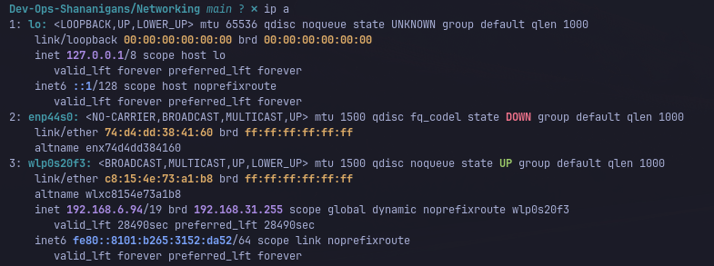
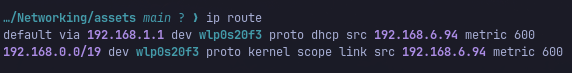
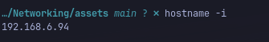
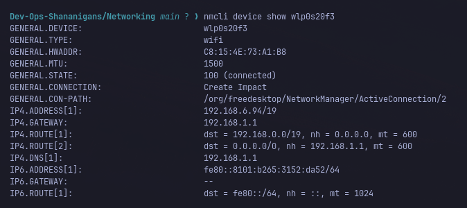
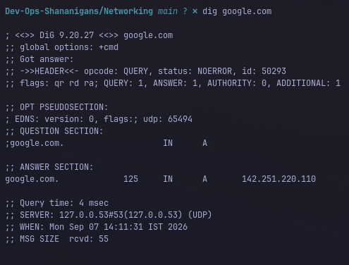
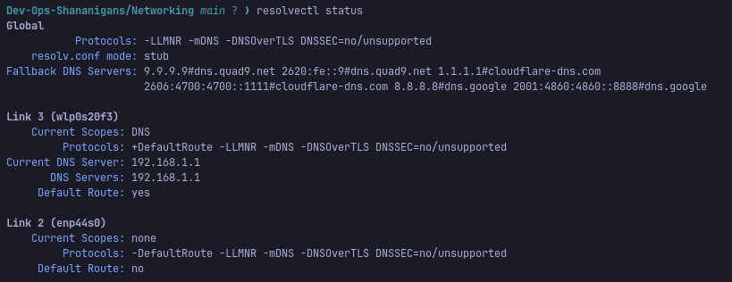
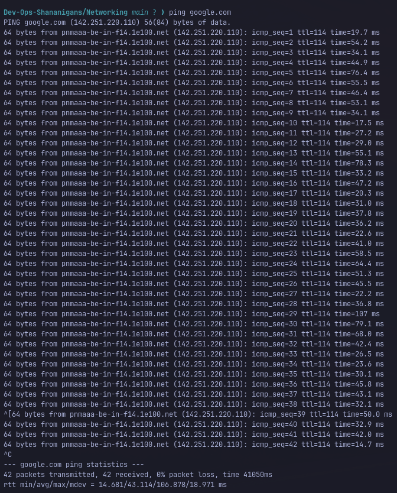

# Networking Playground

## IP & Interface Commands

### ip a
1. Shows the IP address, subnet mask, and MAC address assigned to your network interface.

### ip route
1. Displays the routing table, including your default gateway. Confirms the router's IP that all outbound traffic gets sent through.

### hostname -i
1. Quick one-line print of your machine's current IP address(es). Useful as a fast sanity check without parsing full interface output.

## DHCP Commands

### nmcli device show 'Network-Name'
1. Displays full connection details for an interface managed by NetworkManager, including the DHCP lease info and server identifier.

## DNS Commands

### dig 'site-url'
1. Resolves a domain name to its IP address and shows which DNS server answered. Demonstrates the name-to-IP translation step before any connection is made.

### resolvectl status
1. resolvectl status is a command used in Linux operating systems to display the current global and per-interface DNS resolution settings managed by systemd-resolved.

## Connectivity

### ping google.com
1. Sends ICMP echo requests to test basic reachability and measure round-trip time. Confirms the destination is up and responding before deeper troubleshooting.

